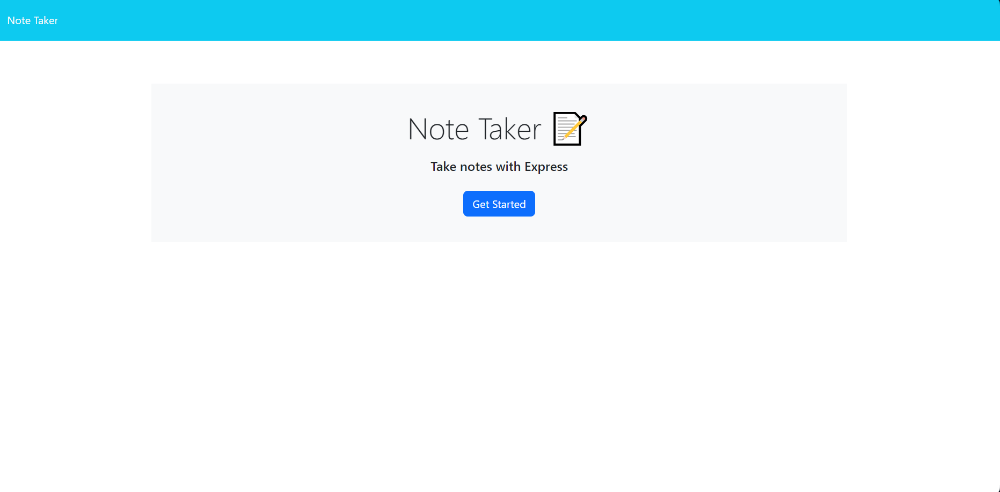

# Note Taker

## Description

This is an application that saves notes that one creates permanently to a server. The front end of this app was provided as a template by edX, however I created all of the back end functionality in this app. In this project, I taught myself how to create get, post, and delete requests with expressjs. One of my challenges was figuring out how to create delete requests, since we were not taught this in my bootcamp. I made the delete functionality solely from my own research!
    
## Table of Contents

- [Installation](#Installation)
- [Usage](#Usage)
- [License](#License)
- [Contributing](#Contributing)
- [Tests](#Tests)
- [Questions](#Questions)
    
## Installation

This application requires no install - it is available via link at the bottom of the page.

## Usage
    
When opening this application, you will come across a home page with a button. Click on this button and you will be taken to the notes page. To post a note, you can click 'new note' at the top left of the page. If you need to clear your note as you create it, you can click the 'clear note' button at the top left of the page.  To view previous notes, you can click on your notes on the left side of the page. To delete a note, click on the red trash can icon on the notes. Keep in mind that this is a global repository - other people will be able to see the notes that you make.

## Screenshot

## License

This project is covered under the MIT license. For more information, visit the link below.

[License Link](./LICENSE)

## Contributing

This is a project for a bootcamp, and it is to show my own work. I will not accept contributions to this project.
    
## Tests

There is no test.js files in this repository, however you can just as easily test this application by clicking on buttons and filling out forms in the web app itself.

## Credits

The front-end template for this project was provided by edX as a part of a bootcamp.
    
## Questions

Have any questions? This is how to contact me:

Github: https://github.com/RuckusEnjoyer

## Link

https://safe-plains-29301-f117403823f1.herokuapp.com